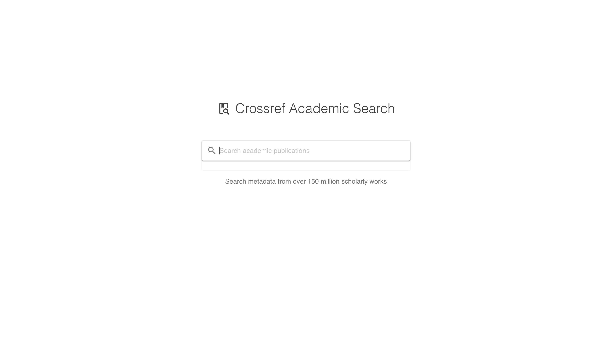
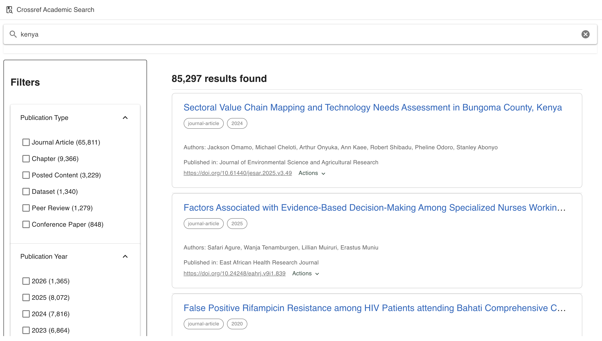

# Crossref Academic Search

## Overview

A Vue 3 + TypeScript search interface for the Crossref REST API, built as a take-home assignment. Allows users to search academic publications and filter results by publication type and year using faceted navigation.


## Screenshots

### Home


### Search Results


## Features

- **Full-text search** across the Crossref metadata database
- **Faceted filtering** by publication type and publication year
- **Active filter chips** with clear functionality
- **Clickable titles** linking to DOI URLs
- **Result details**: authors, publication year, container title, DOI
- **Debounced search input** to minimize API calls
- **AbortController** to cancel stale requests
- **Responsive two-column layout**
- **Accessible markup** with ARIA attributes
- **Clean empty state** before first search
- **Actions menu** with Cite (copy to clipboard) and Metadata as JSON
- **Independent scroll panels** for filters and results
- **Minimum query length** (2 characters) before searching

## Tech Stack

- **Vue 3** (Composition API with script setup)
- **TypeScript**
- **Vuetify 3** (UI component framework)
- **Pinia** (state management)
- **Vite** (build tool)
- **Vitest** (unit testing)
- **Playwright** (E2E testing - configured)

## Getting Started

```bash
# Install dependencies
npm install

# Start development server
npm run dev
```

Open [http://localhost:5173](http://localhost:5173) in your browser.

## Available Scripts

| Command | Description |
|---------|-------------|
| `npm run dev` | Start development server |
| `npm run build` | Production build |
| `npm run preview` | Preview production build |
| `npm run test` | Run unit tests (Vitest) |
| `npm run test:watch` | Unit tests in watch mode |
| `npm run test:e2e` | Run E2E tests (Playwright) |
| `npm run lint` | Lint and fix code |

## Testing

```bash
# Run unit tests
npm run test

# Run tests with detailed output
npx vitest --reporter=verbose

# Install Playwright browsers (for E2E tests)
npx playwright install

# Run E2E tests
npm run test:e2e
```

## Project Structure

```
src/
├── components/
│   ├── FacetPanel.vue      # Filters sidebar
│   ├── ResultItem.vue      # Individual search result
│   ├── ResultsList.vue     # Results grid and empty states
│   └── SearchBar.vue       # Search input
├── stores/
│   └── search.ts           # Pinia store for search state
├── types/
│   └── crossref.ts         # TypeScript interfaces
├── views/
│   └── HomeView.vue        # Main layout
└── main.ts                 # App entry point
```

## Architecture Decisions

### **Pinia Store**
Centralized search state, filter logic, and API calls in a single store. Components stay thin and focused on presentation.

### **Vuetify**
Chosen to match the team's production stack. Provides accessible, well-tested UI primitives out of the box.

### **Debounce + AbortController**
Search triggers 300ms after the user stops typing. Stale in-flight requests are cancelled to avoid race conditions.

### **Facet Data Transformation**
The Crossref API returns facets as key-value objects. These are transformed into sorted arrays in the store, with years limited to the 20 most recent.

### **Conditional Filter Panel**
Filters only appear after a search is performed, keeping the initial UI clean and focused.

### Time Investment
I spent approximately 2 hours on the core functionality (search, facets, filtering, results display). I then invested additional time polishing the UI, adding accessibility features, the Actions menu, and unit tests — areas I felt were worth the extra effort to demonstrate production-quality thinking.

## API Integration

The app integrates with the [Crossref REST API](https://api.crossref.org/) using these endpoints:

- **Search**: `GET /works?query.bibliographic={query}&facet=type-name:*,published:*`
- **Filtering**: Uses `filter` parameter for type and publication year filtering
- **Pagination**: Limited to 10 results per page (configurable)

Example API call:
```
https://api.crossref.org/works?query.bibliographic=machine+learning&facet=type-name:*,published:*&rows=10
```

## Accessibility

- **aria-live region** on results count for screen reader announcements
- **Semantic HTML** with proper heading hierarchy
- **Keyboard-navigable** facet checkboxes
- **Role attributes** on search and results sections
- **Fieldset and legend grouping** for filter categories
- **Focus management** with proper tab order

## What I'd Do With More Time

### **Pagination**
Add offset-based pagination using the Crossref API's `offset` parameter

### **URL State**
Sync search query and active filters to URL query parameters for shareable/bookmarkable searches

### **Caching**
Cache recent search results to avoid redundant API calls on back navigation

### **Sort Options**
Add relevance vs publication date sorting (the API supports both)

### **More Test Coverage**
Expand E2E tests to cover full filter workflows and edge cases

### **Error Retry**
Add automatic retry with exponential backoff for failed API requests

### **Virtual Scrolling**
For performance with large result sets

### **Advanced Search**
Add field-specific search (author, title, DOI, etc.) using Crossref's advanced query syntax

## Known Issues

- **CSS Warnings in Tests**: Vuetify CSS generates warnings in JSDOM but doesn't affect functionality
- **E2E Setup**: Playwright browsers need to be installed separately with `npx playwright install`

## Performance Considerations

- **Debounced Search**: 300ms delay prevents excessive API calls during typing
- **Request Cancellation**: AbortController cancels stale requests
- **Minimal Re-renders**: Computed properties and reactive state minimize unnecessary updates
- **CSS Disabled in Tests**: Improves test performance by skipping CSS processing